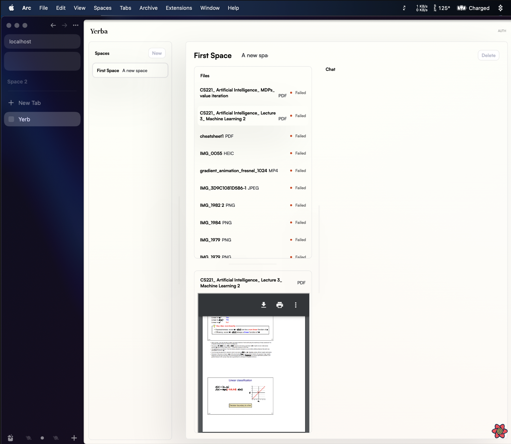

# YERBA

A work in progress playground for interactions between models and data.

<!--  -->



To run server and web app:

```
pnpm i
pnpm gen
pnpm dev
```

Required env vars:

`SPACES_DIR` : Storage location for uploaded files.

`DB_ADDR`: Location for sqlite db.
