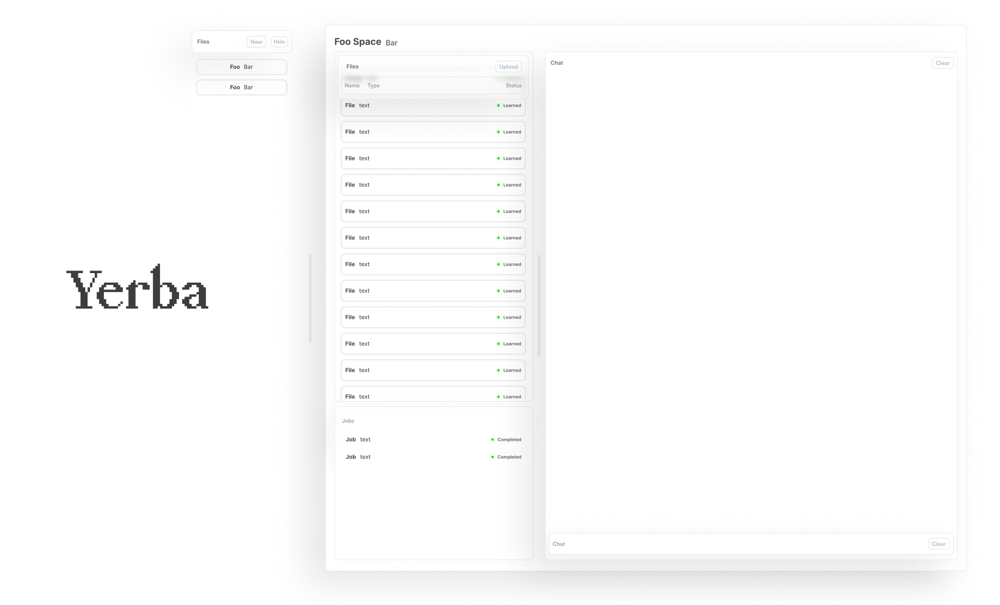

  
  <h1 align="center">Yerba</h1>

<p align="center">
  A work in progress playground for connecting LLMs with data.
</p>

<p align="center">
  <a href="#concepts"><strong>Concept</strong></a> ·
  <a href="#Architecture"><strong>Architecture</strong></a> ·
  <a href="#deploy-your-own"><strong>Progress</strong></a> ·
  <a href="#running-locally"><strong>Running locally</strong></a>
</p>
<br/>

## About

I've found that too much of the time I'm spending around LLMs involves copying external information, most often local data, into the prompt's context window. The project is designed to be an extensible system for bridging that gap.

## Concepts

**Space**: A directory owned by a user. Contains user uploaded files alongside hidden files for executing tasks.

**Task**: Operations that can be performed on a space. Tasks are executed by the node that owns the space. Can be dispatched by users or other tasks.

## Architecture

  
  

## Implementation

  
  

## Progress

- [x] Spaces management
- [x] User authentication
- [x] File uploads and tracking
- [x] Task dispatching and execution system
- [x] File management tasks
- [ ] CI/CD pipeline
- [ ] Vector database tasks
  - [ ] Create database for space
  - [ ] Injesting files
  - [ ] Retrieving files
  - [ ] Request query
- [ ] Chat interface
- [ ] Connect external auth providers
- [ ] Node to node communication (locks on spaces)

## Running locally

```bash
pnpm i
pnpm gen
pnpm dev
```

Be sure to set the following environment variables:
`SPACES_DIR`: The directory where spaces will be stored.
`DB_ADDR`: The address of the database to connect to.
